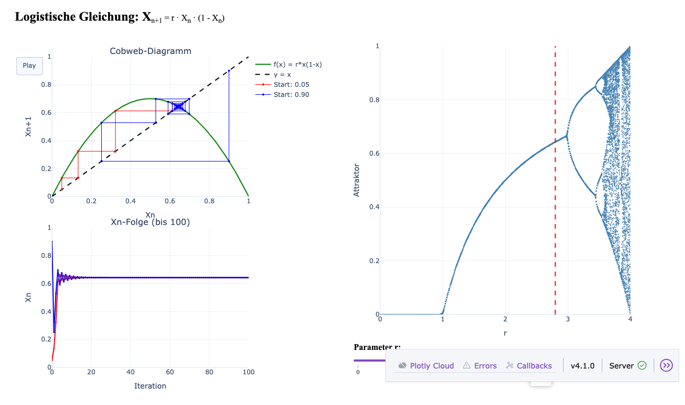

# Feigenbaum Bifurcation Interactive Visualizer

An interactive web application exploring the **Feigenbaum bifurcation** and chaotic dynamics of the logistic map.



## 🎯 Overview

This tool visualizes the fascinating transition from stable behavior to chaos in the logistic map equation:

$$X_{n+1} = r \cdot X_n \cdot (1 - X_n)$$

where:
- **Xₙ** is the population at iteration n (0 to 1)
- **r** is the growth rate parameter (0 to 4)

As you adjust the parameter `r` using the slider, you'll see how the system's behavior dramatically changes—from stable equilibrium, to oscillating cycles, to complete chaos.

## 🚀 Quick Start

### Option 1: Pure HTML/JavaScript (No Server Required)

Simply open **`index.html`** directly in your web browser. That's it! The entire application runs client-side with no installation or server needed.

### Option 2: Python Web App (Interactive Server)

```bash
# Install dependencies
pip install -r requirements.txt

# Run the server
python3 app.py
```

Open your browser to **http://127.0.0.1:8050**

## 📊 Understanding the Visualization

The app displays three interconnected visualizations:

### Left Column: Cobweb Diagram & Sequence Plot

**Top: Cobweb Diagram**
- **Blue curve**: The logistic map function f(x) = rx(1-x)
- **Black dashed line**: y = x (equilibrium line)
- **Red spiral**: Iteration starting from X₀ = 0.05
- **Blue spiral**: Iteration starting from X₀ = 0.90
- **How it works**: Trace vertically to the curve (one iteration), then horizontally to the y=x line, repeat. Watch different starting points converge to the same attractor!
- **Play button**: Animates the iteration process to show convergence in real-time

**Bottom: Xₙ Sequence**
- Shows 100 iterations of the logistic map for both starting points
- Red and blue lines show how Xₙ evolves over time
- Reveals periodic cycles, bifurcations, and chaotic oscillations

### Right Column: Feigenbaum Diagram

The famous **bifurcation diagram** showing:
- **X-axis**: Parameter r (0 to 4)
- **Y-axis**: Attractors (stable values where the system settles)
- **Interpretation**: For each r value, plot 100 points showing where the system "lands" after transient behavior
- **Red dashed line**: Your current r value (move the slider to explore)

## 🌀 The Feigenbaum Bifurcation Explained

### What's a Bifurcation?

A bifurcation occurs when the number of stable states changes. In the logistic map:

| r Range | Behavior | Description |
|---------|----------|-------------|
| **0 < r ≤ 1** | Extinction | Population dies (X → 0) |
| **1 < r ≤ 3** | Stable | Single fixed point, converges to steady state |
| **3 < r ≤ 1+√6 ≈ 3.45** | Period-2 | Oscillates between 2 values (bifurcation!) |
| **3.45 < r ≈ 3.57** | Period-doubling cascade | 2→4→8→16→... oscillations (bifurcations accelerate) |
| **r ≈ 3.57 onwards** | Chaos | Aperiodic, unpredictable behavior |
| **r ≈ 3.83** | Period-3 window | Brief return to periodic behavior within chaos |

### The Magic Number: Feigenbaum Constant

The **Feigenbaum constant** δ ≈ 4.669 describes how fast the period-doubling occurs:

$$\delta = \lim_{n \to \infty} \frac{r_{n} - r_{n-1}}{r_{n+1} - r_{n}}$$

This constant appears in **many chaotic systems** across physics, biology, and engineering—a universal constant of chaos!

### Why It Matters

1. **Route to Chaos**: Shows how ordered systems become chaotic through infinitely many bifurcations
2. **Universality**: The period-doubling cascade appears in pendulums, fluid dynamics, populations, and circuits
3. **Prediction**: Makes "chaos" measurable and partially predictable
4. **Philosophy**: Demonstrates deterministic systems can have unpredictable behavior

## 🎮 How to Use

1. **Adjust the Slider**: Move the parameter r left (stable) to right (chaotic)
2. **Watch the Cobweb**: See how trajectories converge or diverge
3. **Play the Animation**: Click "Play" to watch 50 iterations unfold
4. **Compare Starting Points**: Red (0.05) and blue (0.90) always converge to the same attractor
5. **Study the Bifurcation Diagram**: Notice periods doubling, then chaos, then islands of order

### Recommended Explorations

- **r = 0.8**: Simple decay to extinction
- **r = 2.5**: Stable fixed point
- **r = 3.2**: Period-2 oscillation
- **r = 3.57**: Onset of chaos
- **r = 3.83**: Period-3 window (chaos with order!)
- **r = 4.0**: Full chaos at the boundary

## 🏗️ Architecture

### Pure HTML/JavaScript Version (`index.html`)
- **Frontend**: Vanilla JavaScript (no build tools required)
- **Plots**: Plotly.js (from CDN)
- **Math**: Pure JavaScript computation
- **Performance**: Feigenbaum diagram computed on page load (~5 seconds), cobweb plots cached on demand
- **Size**: ~14 KB HTML (can be opened from anywhere, no server needed)

### Python/Dash Version (`app.py`)
- **Frontend**: Dash (Python interactive framework)
- **Plots**: Plotly (server-side visualization)
- **Math**: NumPy (numerical computation)
- **Performance**: Pre-computed Feigenbaum diagram for responsive interactions

See `CLAUDE.md` for technical architecture details.

## 📚 Learning Resources

- [Logistic Map - Wikipedia](https://en.wikipedia.org/wiki/Logistic_map)
- [Feigenbaum Bifurcation](https://en.wikipedia.org/wiki/Feigenbaum_constants)
- [Chaos Theory Basics](https://en.wikipedia.org/wiki/Chaos_theory)
- Book: *Chaos: Making a New Science* by James Gleick

## 🔧 Customization

Edit `app.py` to:
- Change iteration counts (lines 63-64)
- Adjust visualization resolution (line 10)
- Modify colors, markers, or animation speed
- Add new starting points or analysis features

## 📝 License

Open source — use freely for education and exploration.

## 🤝 Contributing

Found an improvement? Issues with alignment or performance? Contributions welcome!

---

**Explore the boundary between order and chaos.** 🌊
